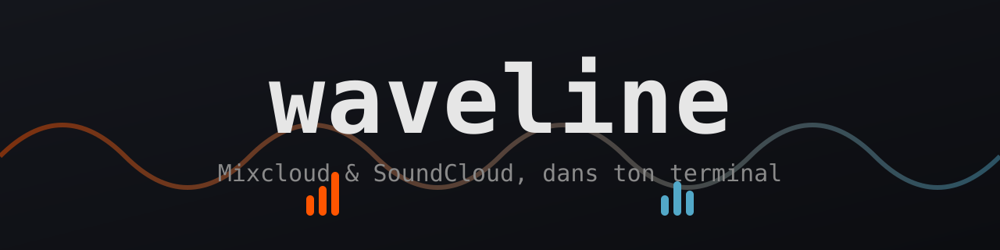

<p align="center">
  
</p>

<p align="center">
  <b>Mixcloud &amp; SoundCloud, together in your terminal.</b><br>
  A clickable TUI, vim keybindings, spectrum analyzer, media keys —
  a standalone Rust binary (no <code>mpv</code>, no <code>yt-dlp</code>, no Python).
</p>

<p align="center">
  
  
  
  
</p>

## Install

**Available now** (Linux x86_64/aarch64):

```sh
npx waveline                                            # try it right away (Node ≥ 14)
cargo install waveline                                  # from crates.io
cargo binstall waveline                                 # pre-built binary, no build step
brew install d101c/tap/waveline                         # Homebrew (Linuxbrew)
cargo install --git https://github.com/d101c/waveline   # build from source
```

Or grab a ready-to-run static binary from the
[Releases](https://github.com/d101c/waveline/releases).

**Coming soon**: `yay -S waveline-bin` (Arch / AUR).

Details & publishing steps: [`docs/PUBLISHING.md`](docs/PUBLISHING.md).

```
┌ waveline ───────────────────────────────────[ All   SC  MC ]─┐
│ ╭ Sources ──────╮ ╭ Search · All ─────────────────────────╮  │
│ │ ♥  Likes      │ │ ▶ Bonobo — Kerala            3:57  SC  │  │
│ │ ☰  Playlists  │ │   Ben UFO — Rinse FM set  1:02:11  MC  │  │
│ │ ◎  Feed       │ │   Four Tet — Two Thousand…   4:10  SC  │  │
│ │ ⌕  Search     │ │   Gilles Peterson — WW Show  2:00  MC  │  │
│ │ ⧗  History    │ │   …                                    │  │
│ │ ▤  Queue      │ │                                        │  │
│ ╰───────────────╯ ╰────────────────────────────────────────╯  │
├───────────────────────────────────────────────────────────────┤
│ ▶ Bonobo — Kerala        ███████░░░░░░░░  1:48 / 3:57          │
╰───────────────────────────────────────────────────────────────╯
```

## Why

Mixcloud and SoundCloud are two separate homes: two apps, two tabs, two
queues. waveline brings them together in the terminal — browse, search, and
listen to both in one place, with the mouse **or** the keyboard.

## Features

- **Two platforms, one interface** — a unified model, interleaved search.
- **Native playback** — 100% Rust decoding (`symphonia`: MP3, AAC/MP4), output
  via PipeWire (`pw-play`) or ALSA (`aplay`). No external player required.
- **Clickable AND keyboard-driven** — click a track to play it, click the
  filter tabs, the play/pause bar; or drive it entirely with vim-style keys.
- **Built-in, reactive visualizers** — 3 styles cycled with `v`: spectrum
  bars, mirror ("waveline"), oscilloscope. A hand-rolled FFT at ~30 Hz,
  rendered at ~30 fps during playback, negligible CPU cost.
- **Media keys & desktop controls** — via MPRIS (D-Bus): Play/Pause, Next,
  Previous, Stop from the keyboard's media keys, the GNOME panel, and the
  lock screen; title/artist/duration are shown there too.
- **With or without an account** — no login needed: public URLs + search.
  With an account: enter your SoundCloud/Mixcloud **handle** (key `c`) and
  your **Likes / Playlists / Feed** populate from public data — no OAuth, no
  token, nothing sensitive stored.
- **Standalone, few dependencies** — a single binary, pure-Rust HTTP
  (`ureq`+rustls), no `tokio`, no system OpenSSL, no `yt-dlp`.
- **English by default, French on demand** — switch language with `L` or a
  click in the sidebar; the choice is remembered across sessions.

## Installation

Requirements: Rust ≥ 1.96, and **`pw-play`** (PipeWire) or **`aplay`**
(alsa-utils) for audio output — available on most Linux distributions.

```sh
git clone git@github.com:d101c/waveline.git
cd waveline
cargo build --release
./target/release/waveline
```

## Usage

Launch `waveline`, then:

| Key | Action | | Key | Action |
|---|---|---|---|---|
| `j` / `k` or `↑`/`↓` | navigate | | `/` | search (SC + MC) |
| `Enter` / click | play the selection | | `:` | paste a URL and play |
| `Space` | play / pause | | `c` | connect your accounts |
| `n` / `p` | next / previous | | `v` | cycle the visualizer |
| `s` | stop | | `1` `2` `3` | filter All / SC / MC |
| `+` / `-` | volume | | `Tab` | switch panel |
| `g` / `G` | top / bottom of list | | `L` | switch language (EN/FR) |
| | | | `q` | quit |
| | | | `?` | help |

### Connecting your accounts

Press `c`, enter your **SoundCloud handle** (Enter), then your **Mixcloud
handle** (Enter). Handles are remembered in
`~/.config/waveline/config.json`. Then open **Likes**, **Playlists**, or
**Feed** in the sidebar: your public data from both platforms is merged
there. No password or token — only public handles.

### Command-line (debug) modes

```sh
waveline resolve <url>          # print the resolved stream for a URL
waveline play <url> [seconds]   # play the stream for N seconds (engine test)
waveline search <query>         # unified SC + MC search
waveline lib <likes|playlists|feed> <sc_handle|-> <mc_handle|->
```

## Architecture

```
src/
├── main.rs         terminal lifecycle, event loop, effect wiring
├── app.rs          pure state + logic (testable, no I/O) → emits Effect
├── ui.rs           ratatui rendering + clickable-zone mapping
├── i18n.rs         UI language (English default, French on demand)
├── model.rs        unified Track (SoundCloud ⇄ Mixcloud)
├── providers/      stream resolution & search
│   ├── soundcloud.rs   scraped client_id, /resolve, transcodings
│   ├── mixcloud.rs     GraphQL cloudcastLookup, XOR decryption
│   └── hls.rs          m3u8 parsing
├── audio/          playback engine
│   ├── player.rs   worker thread: resolve → decode → sink
│   ├── source.rs   progressive HTTP / HLS sources for symphonia
│   ├── sink.rs     PCM output via pw-play / aplay
│   └── spectrum.rs hand-rolled radix-2 FFT + bands (analyzer)
├── config.rs       account handles & language (~/.config/waveline)
├── mpris.rs        MPRIS server (D-Bus): media keys, desktop controls
├── http.rs         shared ureq agent (browser UA)
└── b64.rs          base64 decoder (for the Mixcloud XOR)
```

`App` performs no I/O: it mutates its state and returns `Effect`s (playback,
search) that `main.rs` executes on the engine. The engine runs in a thread
and publishes its state (position, duration, playing/paused) that the UI
reads back each frame. This split makes all navigation testable without a
terminal.

## Known limitations

- **SoundCloud DRM**: some monetized major-label tracks are served as
  encrypted HLS (Widevine/PlayReady). These can't be decrypted by any
  third-party client; waveline reports it and moves on. The vast majority of
  content (mixes, podcasts, independent artists, free uploads) stays
  playable.
- **Mixcloud Select / exclusives**: restricted content can't be fetched.
- These are unofficial APIs and may change; resolution is designed to fail
  cleanly rather than crash.

## Roadmap

- [x] **Account mode** by public handle (Likes / Playlists / Feed).
- [x] Built-in spectrum analyzer.
- [x] Media keys / desktop controls via MPRIS (D-Bus).
- [x] English/French UI language switch.
- [ ] *Private* SoundCloud Likes via a pasted `oauth_token` (optional, outside ToS).
- [ ] Persistent queue and history.
- [ ] Command palette (`Ctrl-P`) and themes.
- [ ] Non-DRM AES-128 encrypted HLS and gapless preloading.

## License

MIT — see [LICENSE](LICENSE).
